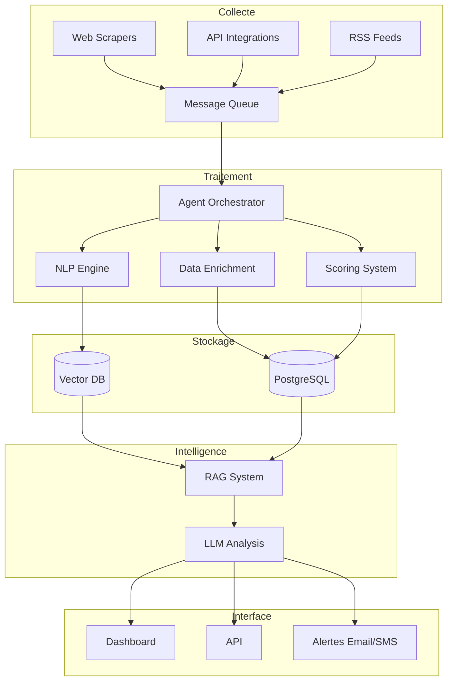

# Système de Veille Concurrentielle pour Neemba Cat

## Vue d'ensemble

Système agentique intelligent pour surveiller la concurrence (SMT/Komatsu et Bia/BIA) et identifier des opportunités de marché dans les secteurs Énergie, Construction et Mines.

## Architecture du Système

### 1. Agents de Collecte d'Information

#### Agent Web Scraping
- **Objectif** : Surveiller les sites web publics
- **Cibles** :
  - Sites web des concurrents (SMT, Bia)
  - Portails de marchés publics
  - Sites d'appels d'offres gouvernementaux
  - Médias sectoriels (construction, énergie, mines)
  - LinkedIn (mouvements de personnel, annonces)
- **Fréquence** : Quotidienne + alertes en temps réel

#### Agent Marchés Publics
- **Objectif** : Détecter les appels d'offres
- **Sources** :
  - Plateformes nationales d'appels d'offres
  - Sites des ministères (Énergie, Mines, Travaux Publics)
  - Banque Mondiale / BAD pour grands projets
  - Portails internationaux (si applicable)
- **Fonctionnalités** :
  - Filtrage par secteur (énergie, construction, mines)
  - Analyse de la valeur du marché
  - Détection de mentions de concurrents

#### Agent Réseaux Sociaux
- **Objectif** : Surveiller l'activité sur les réseaux
- **Plateformes** :
  - LinkedIn (annonces entreprises, recrutements)
  - Facebook (pages entreprises)
  - Twitter/X (actualités instantanées)
- **Détection** :
  - Nouveaux contrats annoncés
  - Partenariats
  - Innovations produits

#### Agent Presse & Actualités
- **Objectif** : Surveiller les médias
- **Sources** :
  - Journaux économiques locaux
  - Médias spécialisés (construction, mines)
  - Communiqués de presse
  - Blogs industriels

### 2. Agents d'Analyse

#### Agent NLP (Natural Language Processing)
- **Fonctions** :
  - Extraction d'entités (noms d'entreprises, projets, montants)
  - Analyse de sentiment
  - Détection de tendances
  - Classification automatique par secteur

#### Agent Enrichissement de Données
- **Objectif** : Croiser les informations collectées avec votre base clients
- **Actions** :
  - Identifier si un client existant lance un appel d'offres
  - Enrichir les profils clients avec nouvelles données
  - Détecter les opportunités de vente croisée
  - Segmentation intelligente

#### Agent Scoring d'Opportunités
- **Critères** :
  - Valeur du marché
  - Probabilité de gain (historique avec le client)
  - Présence confirmée des concurrents
  - Urgence/deadline
  - Alignement avec capacités Caterpillar
- **Output** : Score de priorité pour chaque opportunité

### 3. Agents d'Intelligence Concurrentielle

#### Agent Prix & Positionnement
- **Objectif** : Analyser les stratégies de prix des concurrents
- **Méthodes** :
  - Analyse des marchés publics gagnés (prix publics)
  - Comparaison des offres
  - Détection de tendances tarifaires

#### Agent Stratégie Concurrentielle
- **Analyses** :
  - Cartographie des projets gagnés par concurrent
  - Identification des segments où SMT/Bia sont forts
  - Détection de nouveaux partenariats concurrents
  - Analyse SWOT dynamique

### 4. Agent Notification & Alertes

#### Système d'Alertes Intelligentes
- **Alertes prioritaires** (Notification immédiate) :
  - Nouvel appel d'offres > 500K$ dans vos secteurs
  - Mention de SMT ou Bia sur un marché important
  - Client existant lance un projet
  
- **Rapports réguliers** :
  - Digest hebdomadaire des opportunités
  - Analyse mensuelle de la concurrence
  - Rapport trimestriel des tendances marché

## Architecture Technique

### Stack Technologique Recommandé

### Technologies Spécifiques

#### Backend
- **Framework** : Python FastAPI
- **Agents** : LangGraph / CrewAI / AutoGen
- **Scraping** : Scrapy + Playwright (JavaScript rendering)
- **NLP** : OpenAI GPT-4 / Claude / Llama local
- **Queue** : Redis / RabbitMQ
- **Scheduler** : Apache Airflow / Celery

#### Stockage
- **Base principale** : PostgreSQL (données structurées)
- **Vector DB** : Pinecone / Weaviate / Chroma (embeddings)
- **Cache** : Redis
- **Documents** : S3 / MinIO (PDFs des appels d'offres)

#### Frontend
- **Dashboard** : Next.js / React
- **Visualisations** : Recharts / D3.js
- **Maps** : Leaflet (cartographie des projets)

## Fonctionnalités du Dashboard

### 1. Vue d'ensemble
- KPIs en temps réel :
  - Opportunités actives
  - Valeur totale des marchés détectés
  - Taux de conversion (opportunités → gains)
  - Score de présence concurrentielle

### 2. Pipeline d'Opportunités
- Kanban des opportunités :
  - Nouveau
  - Qualifié
  - En préparation
  - Soumis
  - Gagné/Perdu
- Filtres : secteur, valeur, deadline, concurrent présent

### 3. Intelligence Concurrentielle
- **Profils concurrents** :
  - SMT (Komatsu) : projets récents, secteurs forts, stratégie
  - Bia (BIA) : idem
- **Cartes de chaleur** : où les concurrents gagnent
- **Analyse temporelle** : évolution parts de marché

### 4. Gestion Clients
- **Intégration base 3000 clients** :
  - Enrichissement automatique des profils
  - Historique d'interactions
  - Signaux d'achat détectés
  - Recommandations de contact

### 5. Rapports & Analytique
- Rapports personnalisables
- Export Excel/PDF
- Partage sécurisé avec équipe commerciale

## Sources de Données Prioritaires

### Marchés Publics (Exemples - à adapter selon votre pays)
- Portail national des marchés publics
- Ministères (Énergie, Mines, Infrastructure)
- Organismes régionaux
- Banque Africaine de Développement (si Afrique)
- Portails internationaux

### Médias & Presse
- Journaux économiques locaux
- Mining.com, Construction Dive (internationaux)
- Bloomberg, Reuters (grands projets)
- Médias spécialisés régionaux

### Réseaux Sociaux
- LinkedIn (pages SMT, Bia, clients)
- Facebook entreprises
- Twitter/X pour actualités instantanées

### Sites Web à Surveiller
- Sites officiels SMT et Bia
- Sites des grands clients (mines, sociétés d'énergie)
- Portails d'actualités sectorielles

## Cas d'Usage Concrets

### Scénario 1 : Nouvel Appel d'Offres
1. Agent détecte appel d'offres mine d'or $2M
2. Enrichissement : client existant dans votre base
3. Historique : 3 achats précédents, bon payeur
4. Concurrent : SMT a participé aux 2 derniers
5. **Alerte** : Opportunité haute priorité → Commercial alerté
6. **Insight** : "Client fidèle, mais SMT gagne du terrain"

### Scénario 2 : Activité Concurrentielle
1. Agent détecte : LinkedIn SMT annonce partenariat avec entreprise X
2. Analyse : Entreprise X = votre client potentiel
3. Enrichissement : Projet de $5M en phase d'étude
4. **Alerte** : "SMT approche votre prospect - action requise"
5. **Recommandation** : Contacter prospect avec offre spécifique

### Scénario 3 : Détection de Tendance
1. Agents détectent : 15 appels d'offres "équipements miniers électriques"
2. Analyse NLP : Tendance émergente vers électrification
3. Cross-check : Caterpillar a gamme électrique adaptée
4. **Insight** : "Opportunité stratégique - former équipe sur équipements électriques"

## Plan de Mise en Œuvre

### Phase 1 : Fondations (Mois 1-2)
- [ ] Architecture système
- [ ] Base de données (intégration 3000 clients)
- [ ] Framework agents (LangGraph/CrewAI)
- [ ] Premiers scrapers (sites concurrents + 1 portail marchés publics)
- [ ] Dashboard MVP

### Phase 2 : Expansion Sources (Mois 3-4)
- [ ] Intégration 5-10 sources majeures
- [ ] Agents NLP et enrichissement
- [ ] Système de scoring
- [ ] Tests avec équipe commerciale

### Phase 3 : Intelligence (Mois 5-6)
- [ ] RAG system pour analyse contextuelle
- [ ] Agents d'analyse concurrentielle
- [ ] Rapports automatisés
- [ ] Optimisation algorithmes

### Phase 4 : Production (Mois 7+)
- [ ] Déploiement production
- [ ] Formation équipes
- [ ] Monitoring et amélioration continue
- [ ] Expansion sources additionnelles

## Considérations Importantes

### Légalité & Éthique
> [!IMPORTANT]
> - Scraper uniquement des **données publiques**
> - Respecter robots.txt et conditions d'utilisation
> - Pas de tentatives d'accès non autorisé
> - Conformité RGPD/lois locales sur données

### Sécurité
- Données sensibles chiffrées
- Accès basé sur rôles (RBAC)
- Audit logs de tous les accès
- Hébergement sécurisé (cloud privé recommandé)

### Performance
- Cache pour éviter re-scraping
- Rate limiting pour ne pas surcharger sites sources
- Traitement asynchrone
- Monitoring des coûts API (LLM)

## Estimation Budgétaire

### Infrastructure (Mensuel)
- **Cloud hosting** : $200-500/mois
- **APIs LLM** (OpenAI/Anthropic) : $300-1000/mois
- **Vector DB** : $100-300/mois
- **Monitoring** : $50-100/mois
- **Total infrastructure** : ~$650-1900/mois

### Développement (One-time)
- **Phase 1-2** : 2-3 mois développement
- **Phase 3-4** : 2-3 mois développement
- **Total** : 4-6 mois avec 1-2 développeurs

### ROI Attendu
- Si le système aide à gagner **2-3 marchés supplémentaires** par an
- Valeur moyenne marché : $500K-2M
- **ROI** : Très élevé (10-50x investissement)

## Prochaines Étapes Recommandées

1. **Valider les sources** : Identifier les 10 sources de données les plus critiques pour votre marché
2. **Prioriser les features** : Quelle fonctionnalité apporte le plus de valeur immédiate ?
3. **POC (2-4 semaines)** : 
   - 1 scraper (ex: portail marchés publics)
   - 1 agent d'analyse simple
   - Dashboard basique
   - Test avec 3-5 opportunités réelles
4. **Décision Go/No-Go** : Évaluer résultats POC avant investissement complet

## Questions à Clarifier

1. **Géographie** : Dans quel(s) pays opérez-vous ? (pour cibler les bonnes sources)
2. **Priorités** : Quel secteur prioriser ? (Énergie/Construction/Mines)
3. **Équipe** : Avez-vous des développeurs en interne ou besoin de sous-traitance ?
4. **Budget** : Quel budget mensuel pour infrastructure cloud + APIs ?
5. **Délai** : Objectif de mise en production ?
6. **Données** : Votre base 3000 clients est dans quel format ? (CRM, Excel, DB ?)

---

**Voulez-vous que je commence à implémenter un POC de ce système ?**
