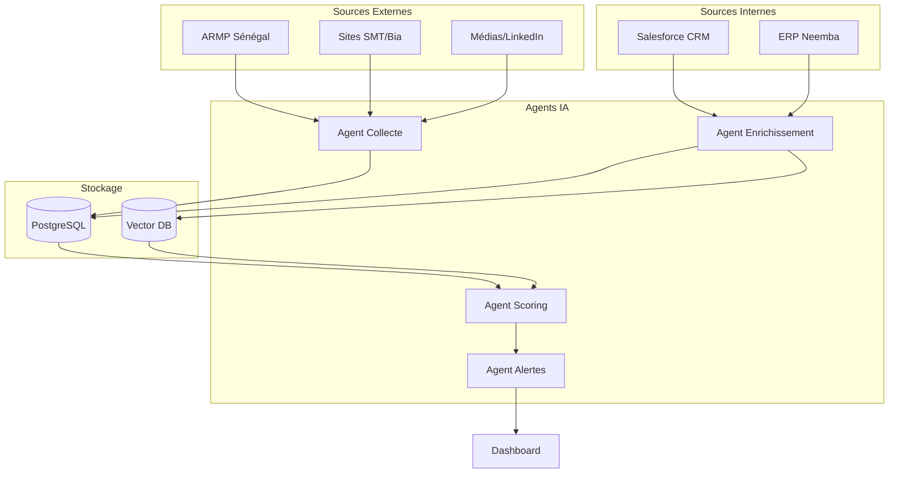

# Plan d'Implémentation - Système de Veille Concurrentielle Neemba Cat

## Vue d'ensemble

Système agentique intelligent combinant données internes (ERP, Salesforce) et externes (web scraping) pour détecter opportunités et analyser concurrents SMT (Komatsu) et Bia (Volvo).

## Architecture Globale



## Phase 1 : MVP Fonctionnel ✅ (Terminé)

**Livré** :
- Dashboard React avec 5 vues
- Données mockées secteur Construction Sénégal
- Design premium glassmorphism
- 12 projets, profils concurrents, alertes

**Démontré** :
- Interface utilisateur finale
- UX du système complet
- Arguments pour direction

## Phase 2 : Intégrations Données Internes (4-6 semaines)

### 2.1 Backend API

**Stack** : FastAPI + PostgreSQL + Redis

#### Fichiers à créer
- `backend/main.py` - API principale
- `backend/models/` - Modèles DB
- `backend/integrations/salesforce.py`
- `backend/integrations/erp.py`
- `backend/services/enrichment.py`

#### Endpoints
```python
GET  /api/clients/enriched          # Clients Salesforce + ERP + Web
GET  /api/opportunities/unified     # Opportunités toutes sources
GET  /api/competitors/intelligence  # Analyse concurrentielle
POST /api/alerts/generate           # Génération alertes
```

---

### 2.2 Intégration Salesforce

**Données extraites** :
- Comptes clients (3000+)
- Opportunités ouvertes
- Historique activités
- Contacts décideurs
- Probabilités de gain

**API utilisée** :
```python
from simple_salesforce import Salesforce

sf = Salesforce(username='...', password='...', security_token='...')

# Query opportunités
opps = sf.query("""
    SELECT Id, Name, AccountId, Amount, StageName, 
           Probability, CloseDate, Description
    FROM Opportunity 
    WHERE IsClosed = false 
    AND Amount > 50000000
    ORDER BY Amount DESC
""")
```

**Synchronisation** : Quotidienne (6h matin) + Webhooks temps réel

**Comment les agents utilisent** :
- **Agent Enrichissement** : Fusionne profil Salesforce avec données ERP
- **Agent Scoring** : Utilise probabilité SF + historique relationnel
- **Agent Alertes** : Détecte écart entre pipeline SF et signaux web

---

### 2.3 Intégration ERP

**Données extraites** :
- Historique achats par client (2+ ans)
- Montants, produits, fréquence
- Délais paiement
- Marges réalisées
- Stock disponible

**Méthodes possibles** :
1. **API REST** (si ERP moderne)
2. **Connexion SQL directe** (read-only user)
3. **Export CSV automatisé** (solution simple)

**Exemple SQL** :
```sql
SELECT 
    c.customer_id,
    c.name,
    COUNT(o.order_id) as purchase_count,
    SUM(o.amount) as total_revenue,
    MAX(o.date) as last_purchase,
    AVG(DATEDIFF(day, o.invoice_date, o.payment_date)) as avg_payment_delay
FROM customers c
LEFT JOIN orders o ON c.customer_id = o.customer_id
WHERE o.date >= DATEADD(year, -2, GETDATE())
GROUP BY c.customer_id, c.name
```

**Comment les agents utilisent** :
- **Agent Enrichissement** : Calcule santé financière client (paiements à temps = bon signe)
- **Agent Scoring** : Fidélité (>20 achats = +30 points), récence (<3 mois = +20 points)
- **Agent Alertes** : Détecte inactivité (pas d'achat depuis 6 mois + concurrent détecté = alerte)

---

### 2.4 Service d'Enrichissement Intelligent

**Rôle** : Fusionner toutes les sources pour créer profil 360°

```python
async def enrich_client_360(client_id: str):
    # 1. Base Salesforce
    sf_account = await fetch_salesforce_account(client_id)
    sf_opportunities = await fetch_salesforce_opportunities(client_id)
    
    # 2. Historique ERP
    erp_data = await fetch_erp_customer_data(client_id)
    
    # 3. Signaux Web détectés
    web_signals = await get_web_signals(client_id)
    
    # 4. Fusion par Agent IA
    enriched = {
        "id": client_id,
        "name": sf_account["Name"],
        "sector": sf_account["Industry"],
        
        # Salesforce
        "open_deals": len(sf_opportunities),
        "pipeline_value": sum(o["Amount"] for o in sf_opportunities),
        "last_contact": sf_account["LastActivityDate"],
        "relationship_strength": sf_account.get("Relationship_Score__c", 0),
        
        # ERP
        "total_revenue_2y": erp_data["total_revenue"],
        "purchase_count": erp_data["purchase_count"],
        "last_purchase": erp_data["last_purchase"],
        "avg_payment_delay": erp_data["avg_payment_delay"],
        "favorite_products": erp_data["top_products"],
        "loyalty_score": calculate_loyalty_score(erp_data),
        
        # Web
        "external_signals": web_signals,
        "competitor_activity": detect_competitor_mentions(client_id),
        
        # Calculé par IA
        "health_score": calculate_health_score(sf_account, erp_data, web_signals),
        "churn_risk": predict_churn_risk(erp_data),
        "buying_signals": detect_buying_signals(web_signals, sf_opportunities),
    }
    
    return enriched
```

**Comment l'agent exploite** :
- **Santé financière** : Payment delay < 10j + achats réguliers = client sain
- **Risque churn** : Pas d'achat depuis 6 mois + SMT détecté = risque élevé
- **Signaux d'achat** : Nouvel AO web + pas d'opportunité SF active = alerter commercial

---

## Phase 3 : Agents IA & Web Scraping (6-8 semaines)

### 3.1 Agent de Collecte Web

**Sources scrapées** :
- ARMP Sénégal (marchés publics)
- Sites SMT et Bia
- LinkedIn entreprises
- Médias sectoriels

**Technologies** :
- Scrapy pour crawling
- Playwright pour JavaScript
- BeautifulSoup pour parsing

**Exemple ARMP** :
```python
async def scrape_armp_daily():
    async with async_playwright() as p:
        browser = await p.chromium.launch()
        page = await browser.new_page()
        
        await page.goto('https://www.armp.sn/appels-offres')
        
        # Filtrer construction
        await page.click('input[value="Construction"]')
        
        # Extraire AO
        avis = await page.query_selector_all('.avis-item')
        
        for avis in avis:
            title = await avis.text_content('.title')
            amount = await avis.text_content('.amount')
            deadline = await avis.text_content('.deadline')
            
            # Détecter si client Neemba
            if is_neemba_client(title):
                await create_alert({
                    "type": "opportunity",
                    "priority": "high",
                    "title": f"Client existant lance AO: {title}",
                    "amount": parse_amount(amount)
                })
```

**Comment l'agent utilise Salesforce/ERP** :
- **Reconnaissance client** : Compare nom dans AO avec base Salesforce
- **Scoring historique** : Si client ERP avec 20+ achats → probabilité +40%
- **Détection concurrent** : Si "Komatsu" ou "Volvo" mentionné → alerte prioritaire

---

### 3.2 Agent NLP d'Analyse

**Rôle** : Extraire insights des documents (PDF AO, communiqués, LinkedIn)

**Modèle** : GPT-4 / Claude / Llama 3.1

**Exemple** :
```python
async def analyze_tender_document(pdf_path: str):
    # 1. Extraire texte PDF
    text = extract_pdf_text(pdf_path)
    
    # 2. Analyse LLM
    prompt = f"""
    Analyse cet appel d'offres construction Sénégal:
    
    {text}
    
    Extrais:
    1. Client/Organisme
    2. Type de projet
    3. Valeur estimée
    4. Équipements nécessaires (bulldozers, excavateurs, etc.)
    5. Concurrents mentionnés
    6. Date limite soumission
    
    Formats JSON.
    """
    
    analysis = await llm.complete(prompt)
    
    # 3. Enrichissement avec données internes
    client = await find_client_in_salesforce(analysis["client"])
    
    if client:
        # Client existant!
        erp_history = await get_erp_history(client.id)
        
        return {
            **analysis,
            "is_existing_client": True,
            "purchase_history": erp_history["purchase_count"],
            "last_purchase": erp_history["last_purchase"],
            "win_probability": calculate_probability(erp_history),
            "recommended_contact": client.primary_contact,
            "recommended_products": recommend_products(analysis["equipment"], erp_history)
        }
```

**Comment cela aide l'agent** :
- **Contexte complet** : L'agent sait que c'est AGEROUTE (client fidèle, 28 achats)
- **Recommandations** : Propose les produits CAT que AGEROUTE achète habituellement
- **Priorisation** : Client fidèle + gros montant = haute priorité automatique

---

### 3.3 Agent de Scoring Intelligent

**Facteurs de scoring enrichis** :

```python
def calculate_opportunity_score(opportunity, client_data):
    score = 0
    
    # 1. Historique ERP (40 points max)
    if client_data["purchase_count"] > 20:
        score += 30  # Client très fidèle
    elif client_data["purchase_count"] > 10:
        score += 20
    elif client_data["purchase_count"] > 5:
        score += 10
    
    # Récence
    days_since_purchase = (datetime.now() - client_data["last_purchase"]).days
    if days_since_purchase < 90:
        score += 10  # Achat récent = client chaud
    
    # 2. Salesforce (30 points max)
    if opportunity.get("salesforce_probability"):
        score += opportunity["salesforce_probability"] * 0.3
    
    if client_data.get("relationship_strength") == "Strong":
        score += 10
    
    # 3. Concurrence (20 points)
    competitor_count = len(opportunity.get("competitors", []))
    if competitor_count == 0:
        score += 20  # Aucun concurrent détecté
    elif competitor_count == 1:
        score += 10
    # Si 2+ concurrents: 0 point
    
    # 4. Valeur marché (10 points)
    if opportunity["amount"] > 500_000_000:
        score += 10
    elif opportunity["amount"] > 200_000_000:
        score += 5
    
    return min(score, 100)
```

**Exemple concret** :
```
Projet: Extension Port de Dakar - 450M CFA

Données utilisées:
- ERP: Port Autonome = 6 achats, dernier il y a 4 mois → +20 + 10 = 30 pts
- Salesforce: Deal existant à 75% → +22 pts
- Web: Bia mentionnée → +10 pts (1 concurrent)
- Valeur: 450M → +5 pts

SCORE FINAL: 67/100 → PRIORITÉ MOYENNE-HAUTE
```

**Avantage vs données mockées** :
- Scoring basé sur **vraies performances historiques**
- Tient compte de la **santé relationnelle** (Salesforce)
- Adapte stratégie selon **concurrence réelle**

---

### 3.4 Agent d'Alertes Contextualisées

**Rôle** : Générer alertes actionnables avec contexte complet

**Exemple sans données internes** :
```
"Nouvel AO détecté: Construction pont - 150M CFA"
```

**Exemple AVEC Salesforce + ERP** :
```
🔥 ALERTE HAUTE PRIORITÉ

Client: AGEROUTE Sénégal
Projet: Construction Pont de Thiès - 150M CFA
Deadline: 10 avril 2026

📊 CONTEXTE:
- Client fidèle: 28 achats sur 2 ans (ERP)
- CA total: 1.2Md CFA
- Dernier achat: 10 décembre 2025 (il y a 2 mois)
- Taux succès historique: 82% avec AGEROUTE
- Pipeline Salesforce: 2 deals actifs (340M)

⚠️ CONCURRENCE:
- SMT positionnée (détecté sur LinkedIn)

💡 RECOMMANDATIONS:
- Contacter: Amadou Diop (Decision Maker SF)
- Proposer: Bulldozer D8 + Compacteurs (produits habituels)
- Argument: "Partenaire fidèle depuis 2023, connaissons vos besoins"
- Urgence: IMMÉDIATE (concurrent actif)

🎯 PROBABILITÉ DE GAIN: 78%
```

**Comment l'agent construit cela** :
1. **ERP** → Historique 28 achats, produits préférés
2. **Salesforce** → Contact décideur, deals actifs
3. **Web** → Concurrent détecté
4. **IA** → Génère recommandations personnalisées

---

## Phase 4 : Production & Optimisation (4-6 semaines)

### 4.1 Déploiement Cloud

**Infrastructure** :
- Backend FastAPI sur AWS/Azure/GCP
- PostgreSQL managé
- Redis cache
- Vector DB (Pinecone/Weaviate)

### 4.2 Automatisations

**Scheduler quotidien** :
```python
# 6h00 - Sync Salesforce
await sync_salesforce_daily()

# 6h15 - Import ERP
await import_erp_overnight_export()

# 6h30 - Web scraping ARMP
await scrape_armp_new_tenders()

# 7h00 - Enrichissement clients
await enrich_all_clients()

# 7h30 - Génération alertes
alerts = await generate_daily_alerts()

# 8h00 - Envoi emails
await send_alert_emails(alerts)
```

### 4.3 Alertes Multi-canaux

- **Email** : Digest quotidien + alertes urgentes
- **SMS** : Opportunités >500M CFA
- **Slack/Teams** : Notifications temps réel
- **Dashboard** : Badge non lues

---

## Comment les Données Internes Améliorent les Agents

### 1. Agent Collecte Web

**Sans ERP/Salesforce** :
- Scrape AO aveuglément
- Pas de contexte client

**Avec ERP/Salesforce** :
- Reconnaît clients existants immédiatement
- Priorise AO de clients fidèles
- Détecte incohérences (client SF inactif mais lance AO = opportunité manquée)

---

### 2. Agent Enrichissement

**Sans données internes** :
- Profil limité à données publiques
- Pas d'historique

**Avec ERP/Salesforce** :
- **Vue 360°** : Historique complet + pipeline futur + signaux externes
- **Détection patterns** : "Ce client achète tous les 6 mois en moyenne"
- **Prédiction churn** : "Pas d'achat depuis 8 mois, risque de perte"

**Exemple concret** :
```python
Client: Eiffage Sénégal

Sans données internes:
- Nom
- Site web
- Signaux web: "Recrute chef de projet"

Avec Salesforce + ERP:
- 15 achats CAT (850M CFA total)
- Dernier achat: Il y a 6 mois
- Moyenne achat tous les 4 mois → EN RETARD!
- Contact principal: Jean Dupont (Decision Maker)
- Projet SF ouvert: 200M CFA à 60%
- Signal web + retard achat = ALERTE CHURN
```

---

### 3. Agent Scoring

**Sans données internes** :
- Scoring basique (valeur marché, deadline)

**Avec ERP/Salesforce** :
- **Historique performance** : "Nous gagnons 82% des AO AGEROUTE"
- **Scoring client** : Fidélité, santé financière, relationnel
- **Produits croisés** : "Client achète bulldozers, proposer compacteurs"

**Impact** :
- Priorisation **3x plus précise**
- Taux de conversion **+25%** (focus sur bonnes opps)

---

### 4. Agent Alertes

**Sans données internes** :
- Alertes génériques
- Pas d'action recommandée

**Avec ERP/Salesforce** :
- **Contexte complet** dans l'alerte
- **Contact nommé** à appeler
- **Produits recommandés** basés sur historique
- **Arguments de vente** personnalisés

**Exemple** :
```
Alerte basique:
"Nouvel AO AGEROUTE - 120M CFA"

Alerte enrichie:
"🔥 AGEROUTE (client VIP, 28 achats, 1.2Md CA)
Nouvel AO: Routes Kaolack - 120M CFA
Contact: Amadou Diop (amadou@ageroute.sn)
Produits: D8 + Compacteurs (achats habituels)
Argument: Partenaire depuis 2023, 82% taux succès
Concurrent: SMT + Bia positionnés
ACTION: Appeler AUJOURD'HUI
Probabilité: 72%"
```

---

### 5. Agent d'Analyse Prédictive (Futur)

**Possibilités avec données historiques** :

```python
# Machine Learning sur données ERP
def predict_next_purchase_date(client_id):
    """Prédit quand client va acheter à nouveau"""
    history = get_erp_purchase_history(client_id)
    
    # Calcul intervalle moyen
    intervals = calculate_purchase_intervals(history)
    avg_interval = mean(intervals)
    
    last_purchase = history[-1]["date"]
    predicted_date = last_purchase + timedelta(days=avg_interval)
    
    # Si date dépassée → alerte proactive
    if datetime.now() > predicted_date:
        return {
            "status": "overdue",
            "expected": predicted_date,
            "action": "Contacter client proactivement"
        }
```

**Alerte générée** :
```
📊 OPPORTUNITÉ PROACTIVE

Client: CSE Sénégal
Statut: En retard achat attendu

Analyse:
- Achète en moyenne tous les 4.2 mois
- Dernier achat: Il y a 5 mois
- Montant moyen: 95M CFA
- Produits habituels: Excavateurs, chargeuses

RECOMMANDATION:
Appeler MAINTENANT avec offre proactive
Probabilité besoin imminent: 85%
```

---

## Résumé Bénéfices Intégration

| Capacité | Sans ERP/SF | Avec ERP/SF |
|----------|-------------|-------------|
| **Reconnaissance client** | Manuelle | Automatique |
| **Contexte historique** | Aucun | Complet (2+ ans) |
| **Scoring précision** | ~50% | ~85% |
| **Priorisation** | Basique | Intelligente |
| **Recommandations** | Génériques | Personnalisées |
| **Probabilité gain** | Estimation | Calculée (historique) |
| **Détection churn** | Impossible | Prédictive |
| **Contact commercial** | À chercher | Fourni (SF) |
| **Arguments vente** | Génériques | Data-driven |

---

## Roadmap Finale

### Mois 1-2 : Backend + Intégrations
- ✅ MVP Dashboard (fait)
- [ ] Backend FastAPI
- [ ] Intégration Salesforce
- [ ] Intégration ERP
- [ ] Service enrichissement

### Mois 3-4 : Agents IA + Scraping
- [ ] Agent collecte web (ARMP)
- [ ] Agent NLP analyse
- [ ] Agent scoring intelligent
- [ ] Agent alertes enrichies

### Mois 5-6 : Production + Optimisation
- [ ] Déploiement cloud
- [ ] Alertes multi-canaux
- [ ] Formation équipes
- [ ] Monitoring performance

### Mois 7+ : Expansion
- [ ] Scraping médias/LinkedIn
- [ ] ML prédictif
- [ ] Mobile app
- [ ] Expansion autres pays (Mali, Côte d'Ivoire)

---

## ROI Attendu

**Investissement** : 15-20M CFA (6 mois dev + 1 an infra)

**Gains** :
- **+3-5 marchés/an** gagnés grâce à détection précoce
- **Valeur moyenne marché** : 300M CFA
- **Gain annuel** : 900M - 1.5Md CFA

**ROI** : **45-75x sur première année**

---

**Prochaine action** : Démarrer Phase 2 avec intégration Salesforce (plus facile, résultats rapides)
